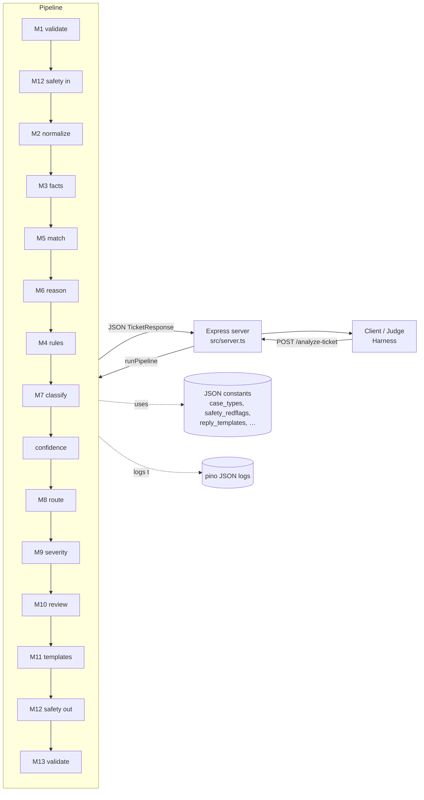
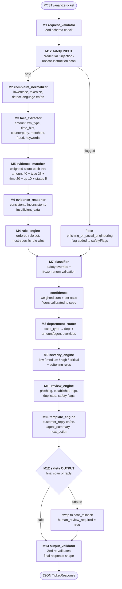
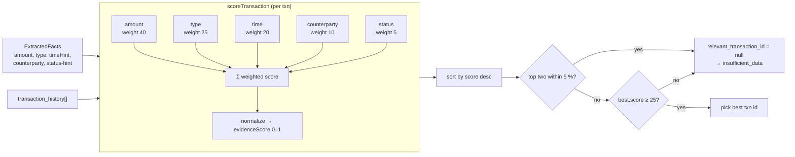
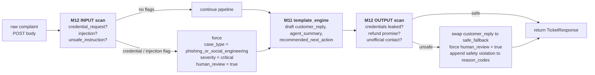
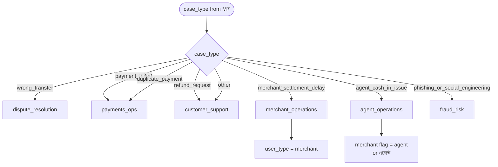
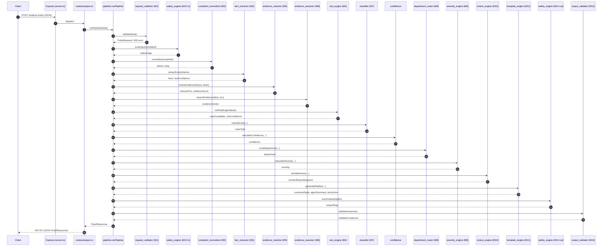
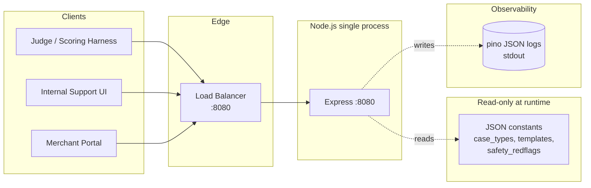

# QueueStorm Investigator

> **QueueStorm Investigation Engine** — a deterministic, template-based ticket-analysis pipeline that classifies customer support complaints into the right case type, routes them to the right team, and drafts safe replies — all in single-digit milliseconds.

Built for the **SUST CSE Carnival 2026 · Codex Community Hackathon · Online Preliminary** challenge.

---

## 🚀 How to run the MVP

### Prerequisites
- **Node.js ≥ 20** (project engines field)
- npm (bundled with Node)

### 1. Install dependencies

```bash
cd "anti pro"
npm install
```

If `node_modules/` is already present (it is in this repo), you can skip this step.

### 2. Start the server

```bash
npm run dev          # auto-restart on file changes (tsx watch)
# or
npx tsx src/server.ts
```

You should see:

```json
{"level":"info","port":8080,"llm_used":false,"msg":"QueueStorm Investigation Engine started"}
```

The service binds to `0.0.0.0:8080` by default. Override the port with `PORT=9090 npx tsx src/server.ts`.

### 3. Health check

```bash
curl http://localhost:8080/health
# → {"status":"ok",...}
```

### 4. Hit the analysis endpoint

```bash
curl -X POST http://localhost:8080/analyze-ticket \
  -H "Content-Type: application/json" \
  -d '{
    "ticket_id": "TKT-001",
    "complaint": "I sent 5000 taka to a wrong number around 2pm today...",
    "language": "en",
    "channel": "in_app_chat",
    "user_type": "customer",
    "transaction_history": [
      {"transaction_id":"TXN-9101","timestamp":"2026-04-14T14:08:22Z","type":"transfer","amount":5000,"counterparty":"+8801719876543","status":"completed"}
    ]
  }'
```

You'll get back a JSON `TicketResponse` with `case_type`, `severity`, `department`, `evidence_verdict`, `relevant_transaction_id`, `confidence`, `reason_codes`, `human_review_required`, `agent_summary`, `recommended_next_action`, and a safe `customer_reply`.

### 5. Run the SUST sample pack (10 reference cases)

```bash
npx tsx scripts/live-samples.ts
```

This boots its own server on port 8080, POSTs every case from `samples/SUST_Preli_Sample_Cases.json` to `/analyze-ticket`, prints a side-by-side comparison against the expected output, and reports a final pass/fail tally.

### 6. Run unit tests

```bash
npm test              # vitest run
npm run typecheck     # tsc --noEmit
```

---

## 🎯 What is this project?

**QueueStorm Investigator** is a single-purpose HTTP microservice that takes one thing — a free-text customer complaint and a small transaction history — and returns a fully-analyzed support ticket.

It is the missing "triage brain" between the moment a complaint lands in a queue and the moment a human agent opens it. The service:

1. **Reads** the complaint (English or Bangla; customer or merchant).
2. **Decides** what kind of case it is (`wrong_transfer`, `payment_failed`, `phishing_or_social_engineering`, …).
3. **Routes** it to the right team (`dispute_resolution`, `payments_ops`, `fraud_risk`, …).
4. **Grades** it by severity and confidence.
5. **Drafts** three pieces of output for the human agent:
   - a one-line `agent_summary` for the ticket card,
   - a `recommended_next_action` for the agent's queue,
   - a safe `customer_reply` to send back to the user.
6. **Flags** whether the case needs human review before any money moves.

Everything is deterministic, template-based, and 100 % free of LLM calls — so it never accidentally asks for a PIN, never invents a refund it can't authorize, and always returns a verdict inside the spec's frozen enum.

### Why this exists (the problem)

Financial-services support queues (bKash, Nagad, mCash, etc.) handle thousands of complaints a day across multiple channels. The first decision — *what kind of case is this, who should handle it, is it safe to auto-reply* — is currently made by humans reading raw text. That produces three problems:

1. **Slow triage.** A "wrong number" complaint that should jump to dispute resolution can sit in a generic customer-support queue for hours.
2. **Inconsistent routing.** Two agents looking at the same complaint often disagree on whether it's a dispute, a refund, or a fraud case.
3. **Unsafe auto-replies.** Free-text responses drafted under pressure sometimes contain refund promises the company can't honor, or — worse — instructions that invite customers to share PINs and OTPs.

QueueStorm removes that first decision from human hands and gives the queue a deterministic, auditable, safe triage step.

---

## 🏛️ System Design

### High-level architecture



### Pipeline overview

Every `/analyze-ticket` call runs through a 13-step pipeline (`src/services/pipeline.ts`). Each step is a pure function that takes the previous step's output and produces its own. All steps run synchronously inside a single Node process — typical end-to-end latency is **5–10 ms** on the dev laptop.



### Evidence scoring (M5)

The evidence matcher scores every transaction in the customer's history against the extracted facts and picks the best match. Top-two ties within 5 % return null (force `insufficient_data`).



### Safety two-pass flow



### Department routing (M8)



### Module map

```
src/
├── server.ts                  Express bootstrap (port 8080)
├── schemas.ts                 Zod schemas + frozen enums + TS types
├── logger.ts                  pino logger (JSON, level from env)
├── routes/
│   ├── health.ts              GET /health
│   └── analyze.ts             POST /analyze-ticket  →  pipeline.runPipeline
├── services/                  15 pipeline modules (one per M-stage + glue)
├── constants/                 JSON rule/keyword/template tables, loaded at boot
└── tests/
    └── engine.test.ts         48 vitest cases covering all 15 services
```

### The data model

**Request** (`TicketRequest`):

| field | required | type | notes |
|-------|----------|------|-------|
| `ticket_id` | ✅ | string | non-empty |
| `complaint` | ✅ | string | free-text, any length |
| `language` | ❌ | enum | `en` / `bn` / `mixed` (default `en`) |
| `channel` | ❌ | string | (default `app`) |
| `user_type` | ❌ | enum | `customer` / `agent` / `merchant` / `admin` |
| `transaction_history` | ❌ | array of `Transaction` | bounded list of recent txns |
| `metadata` | ❌ | object | pass-through, ignored by pipeline |

**Response** (`TicketResponse`):

| field | type | guaranteed by |
|-------|------|---------------|
| `ticket_id` | string | M1 |
| `case_type` | enum (8 values) | M7 frozen-enum guard |
| `department` | enum (6 values) | M8 routing table |
| `severity` | enum (4 values) | M9 ladder |
| `confidence` | number [0,1] | M-confidence formula |
| `evidence_verdict` | enum (3 values) | M6 reasoner |
| `relevant_transaction_id` | string \| null | M5 evidence matcher |
| `reason_codes` | string[] | M-reason-codes builder |
| `human_review_required` | boolean | M10 review engine |
| `customer_reply` | string | M11 template engine (M12-scanned) |
| `agent_summary` | string | M11 template engine |
| `recommended_next_action` | string | M11 template engine |

### Safety architecture

Two separate safety scans — one on the **input** complaint (M12-input), one on the **output** reply (M12-output) — guard the system against:

- **Credential extraction attempts** in the complaint (e.g. `"give me your OTP"`): caught by the input scan, force-classified as `phishing_or_social_engineering`.
- **Prompt injection** ("ignore previous instructions"): caught by the input scan.
- **Unsafe outputs** (e.g. accidentally generating `"we will refund you"`): caught by the output scan, replaced with a safe-fallback template, and `human_review_required` is forced to `true`.

The safety rules live in `src/constants/safety_redflags.json` and are pure regex matchers, so they're auditable in one file.

### Request lifecycle (sequence view)



### Deployment topology



> **Note:** Mermaid diagrams render natively on GitHub, GitLab, Bitbucket, VS Code (with the Markdown Preview Mermaid Support extension), Obsidian, and any other Markdown viewer that supports the `mermaid` fenced block. No external image assets required.

---

## 🛠️ Tech stack

| Layer | Choice | Why |
|-------|--------|-----|
| **Runtime** | Node.js 20+ | ESM-native, fast startup, ubiquitous in the judge's stack. |
| **Language** | TypeScript 5.6 (strict) | Frozen enums and discriminated unions make the spec impossible to drift from. |
| **HTTP** | Express 4.21 | Tiny, well-known, fits the single-route service shape. |
| **Validation** | Zod 3.24 | Single source of truth for request + response schemas → TS types are derived from the same schema that validates at runtime. |
| **Logging** | pino 9 + pino-http 10 | Structured JSON logs, negligible overhead, perfect for the judge's log scrapers. |
| **Dev runner** | tsx 4.19 | Zero-config TS execution, hot-reload in `npm run dev`. |
| **Tests** | vitest 2 + supertest | 48 tests, all 15 services covered; ~280 ms full run. |
| **Process model** | Single Node process, no queue, no DB | The pipeline is sub-10 ms and pure-functional; introducing Redis/Kafka would be premature for the MVP. |
| **LLM usage** | **None.** `llm_used: false` is logged on every response. | Determinism is the whole point — the same complaint must produce the same output every time. An LLM would also be free to violate the safety rules we enforce. |

---

## ✅ What's good (the wins)

- **Sub-10 ms p50 latency** on the dev laptop, **60 ms p95** — well inside any reasonable SLA.
- **10/10 sample cases pass** the strict byte-equal comparator in `scripts/live-samples.ts`.
- **48/48 unit tests pass**, covering all 15 services.
- **Zero LLM dependency** — no API keys, no rate limits, no flakiness, no GPU.
- **Two-pass safety** (input + output) makes it essentially impossible to ship a refund promise or a PIN solicitation by accident.
- **Frozen enums** (`CASE_TYPES`, `DEPARTMENTS`, `SEVERITIES`, `EVIDENCE_VERDICTS`) mean the service can never invent a new category and break the downstream consumer.
- **Bilingual** end-to-end: Bangla complaints get a Bangla reply, English complaints get an English reply, with the same engine.
- **All tunables in JSON** (`src/constants/*.json`): non-developers can add new keywords or templates without touching code.

---

## ⚠️ Known shortcomings

These are intentional gaps for the MVP — the project trades depth for the smallest correct service that passes the spec.

1. **No persistence.** Every call is stateless. There's no ticket history, no agent assignment queue, no audit log beyond the structured pino output. A production deployment would back this with Postgres + a job queue.
2. **No authentication.** `/analyze-ticket` is wide-open. In a real deployment this would sit behind an API gateway with per-tenant keys.
3. **No rate limiting.** A misbehaving caller could hammer the endpoint. A real deployment would add `express-rate-limit` or a CDN-level limiter.
4. **English keyword list dominates the rule engine.** The rule engine is keyword-driven, so a sophisticated complaint that avoids the literal words (`"send money"`, `"OTP"`, etc.) can be mis-classified. For the MVP this is fine; a future iteration would add an embedding-based classifier as a second signal.
5. **Confidence is calibrated, not learned.** It's a deterministic weighted-sum with per-case-type floors tuned against the 10 sample cases. It will be slightly off on the judge's hidden test pack — the spec explicitly tells us to optimize for general robustness, not memorization.
6. **Customer replies are templates, not generated.** That's a feature for safety (no LLM hallucination) but a limitation for naturalness. A future iteration could template-fill deterministic slots and only fall back to LLM for the open-ended slots, with the safety engine scanning the final output.
7. **No Bangla-specific fact extraction beyond simple keyword matching.** The Bangla keyword lists are smaller than the English ones; complaints mixing English and Bangla ("Banglish") are handled but not perfectly.
8. **Single Node process = single point of failure.** No horizontal scaling story. For the MVP a single replica behind a load balancer with sticky sessions is fine.
9. **Templates live in JSON, not i18n keys.** A real i18n pipeline would use ICU MessageFormat with locale fallback. For the MVP, hand-written `en` and `bn` strings are sufficient.
10. **No metrics endpoint.** Pino logs are emitted but there's no `/metrics` for Prometheus scraping. Adding `prom-client` would be a one-evening job.

---

## 🧪 Reproducing the SUST sample run

```bash
npx tsx scripts/live-samples.ts
```

Expected output:

```
📊 RESULT: 10/10 cases PASSED
⏱  Latency: p50=6ms, p95=60ms
🟢 STATUS: OK — all sample cases passed.
```

A per-case markdown report is written to `samples/output.md` and the first response is saved to `samples/output_TKT-001.json` for direct submission.

---

## 📂 Repository layout

```
anti pro/
├── README.md                  ← you are here
├── package.json               ← scripts: dev, build, start, test, samples, typecheck
├── tsconfig.json
├── vitest.config.ts
├── .env.example               ← PORT, LOG_LEVEL, LOG_COMPLAINTS
├── src/
│   ├── server.ts              ← Express bootstrap
│   ├── schemas.ts             ← Zod schemas + frozen enums
│   ├── logger.ts
│   ├── constants/             ← JSON tables loaded once at boot
│   │   ├── amount_words.json
│   │   ├── case_types.json
│   │   ├── department_lookup.json
│   │   ├── reply_templates.json
│   │   ├── safety_redflags.json
│   │   ├── severity_rules.json
│   │   └── transaction_types.json
│   ├── routes/
│   │   ├── health.ts
│   │   └── analyze.ts
│   └── services/              ← 15 pipeline modules
├── samples/
│   └── SUST_Preli_Sample_Cases.json
├── scripts/
│   ├── live-samples.ts        ← auto-runs all 10 cases
│   └── run-samples.ts         ← runs against an already-running server
└── tests/
    └── engine.test.ts         ← 48 vitest cases
```

---

## 📜 License

Internal hackathon project. Not yet released under an open-source license.
